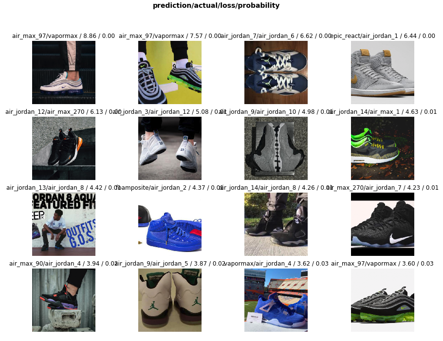

# What Sneaker is That? Creating a Sneakers Classifier
## How to build a custom dataset, train a deep neural network, and deploy a web app

You can try out the app at https://what-sneaker.onrender.com/.
A Medium post summarizing the steps can be found at https://medium.com/@chrispmaag/creating-a-sneakers-classifier-541682faf061.

## Sample results from the app

## Credit

The Jupyter notebook and web app are based on materials from Jeremy Howard's fastai [deep learning course](http://course.fast.ai/ "Fastai").
To deploy to Render, check out https://course.fast.ai/deployment_render.html.

## Packages

The notebook uses the fastai v1 library, which contains many useful data loading and computer vision functions.

## Motivation

My goal was to create a sneakers classifier where I could take a picture of someone’s shoes and quickly learn what model they were wearing.

## Files

The three main files are:

- **sneakers_classifier_final.ipynb**, which walks through training Resnet50 on the sneaker images
- **app/server.py**, which sets up the web app and outputs the top three predicted classes
- **app/view/index.html**, which creates the front end of the web app

## Results

### How well did ResNet50 do on 24 classes of sneakers?

We can take advantage of transfer learning and get great results by utilizing a resnet architecture. I started with resnet34, then eventually used resnet50 in the web app. With a little fine tuning and after a few epochs, we are able to achieve greater than 90% accuracy on the validation set.

### Let's look at the top losses

When we visually examine our top losses using plot_top_losses from fastai’s library, we see the model is doing well. On three of the shoe images below, the model predicted Air Max 97 instead of Vapormax (images 1, 2 and 16). Those images are actually a hybrid of the two models featuring an Air Max 97 upper on a Vapormax outsole. We have a few other shoes shot from unique angles that also challenge the model.
